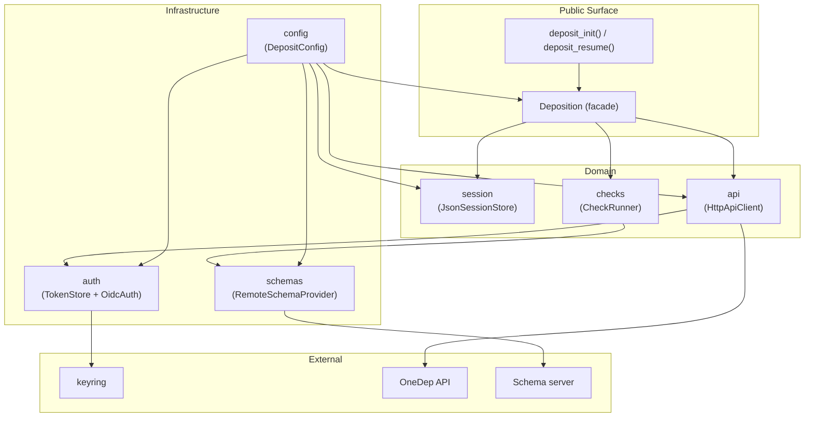

# Architecture proposal for Prototype

Moving away from the mock package, this is a proposal for a clean architecture for DSP to organize the code and improve maintainability. Please, read carefully and if agreed I'll refactor the code and place stubs where implementation is yet to be discussed.

## Protocol + Dependency Injection

We'll be using `Protocol`s to dictate class design. Concrete implementations satisfy their Protocol structurally. `ABC` could also be used here, so if this feels more familiar to everyone, we can switch. The `Deposition` facade receives implementations via constructor injection, wired by factory functions. This gives:

- **Testability:** tests pass lightweight in-memory stubs without mocking frameworks
- **Swappability:** third parties can provide their own implementations (e.g. DB-backed session store) without importing our Protocol
- **Low coupling:** implementations have no dependency on the Protocol definition

---

## Package structure

```
src/nextdep_dsp/
├── __init__.py          # public surface — the only import users need
├── dsp.py               # Deposition facade
├── config.py            # DepositConfig (layered config)
├── exceptions.py        # typed exception hierarchy
│
├── auth/
│   ├── __init__.py
│   ├── types.py         # AuthProvider Protocol
│   ├── oidc.py          # OidcAuth: browser OIDC flow + one-time code exchange. Still to be agreed upon.
│   └── token.py         # TokenStore: JWT + refresh lifecycle, keyring backend
│
├── api/
│   ├── __init__.py
│   ├── types.py         # ApiClient Protocol
│   ├── client.py        # HttpApiClient (requests + Bearer JWT)
│   └── models.py        # Deposit, DepositedFile, DepositStatus, Experiment, ...
│
├── checks/              # This name can be changed! We're still not fully in agreement about names.
│   ├── __init__.py
│   ├── runner.py        
│   └── report.py        
│
├── schemas/             # module to manage JSON schemas (fetch, cache etc)
│   ├── __init__.py
│   ├── types.py         # SchemaProvider Protocol
│   └── remote.py        # RemoteSchemaProvider: fetch + local disk cache
│
└── session/
    ├── __init__.py
    ├── types.py         # SessionStore Protocol
    ├── models.py        # LocalSession, LocalFile (dataclasses)
    └── json_store.py    # JsonSessionStore: ~/.nextdep/sessions/<uuid>/session.json
```

`__init__.py` is the only public surface — everything else is an implementation detail. `exceptions.py` is top-level so callers can catch without importing internals. `schemas/` is independent of both `checks/` and `session/` — both consume it.

---

## Component responsibilities

### `config`
Reads `~/.config/nextdep/config.toml`, environment variables, and constructor overrides in order of increasing priority. Produces a `DepositConfig` dataclass. No dependencies on any other component in the library.

### `exceptions`
Typed hierarchy with no dependencies (this is just an example):

```
NextDepError (base)
├── AuthError       # OIDC flow failures, token expired/invalid, keyring unavailable
├── ApiError        # HTTP errors from OneDep API  (DepositApiException is the public alias)
├── ConfigError     # missing/invalid configuration
└── SchemaError     # schema fetch failure, cache corrupt, validation engine error
```

`FileNotFoundError` is raised as-is from `add_file()`.

### `auth`
Two responsibilities kept in separate classes:

- **`OidcAuth`** — opens the system browser, starts a local loopback server (RFC 8252), completes the ORCID → OneDep OAuth2 + OIDC flow, exchanges the one-time code for tokens, and hands them to `TokenStore`.
- **`TokenStore`** — reads and writes the JWT access token and opaque refresh token via `keyring` (Keychain on macOS, DPAPI on Windows, libsecret on Linux). Transparently refreshes the access token when expired before any API call.

### `schemas`
`RemoteSchemaProvider` fetches JSON schemas from a configurable base URL and caches them on disk (`~/.nextdep/schemas/`). The base URL is set in `DepositConfig`, so tests can point at a local server. Both mmCIF validation schemas and required-file rules are served as remote schemas.

### `api`
`HttpApiClient` is a thin HTTP wrapper (requests, Bearer JWT). It calls `TokenStore.get_access_token()` before each request — token refresh is transparent to callers. No business logic. Raises `ApiError` on non-2xx responses.

### `checks`
`CheckRunner` uses `SchemaProvider` to fetch the relevant schema, then validates the file or session against it. Always returns `CheckReport`. Never raises for validation failures — only raises `SchemaError` if the schema itself cannot be obtained.

### `session`
`JsonSessionStore` persists `LocalSession` and `LocalFile` dataclass objects as JSON at `~/.nextdep/sessions/<uuid>/session.json`. Pure I/O, no business logic. Atomic writes via a `.tmp` swap.

### `dsp` (Deposition facade)
Orchestrates all of the above. Accepts `SessionStore`, `ApiClient`, and `CheckRunner` via constructor. Never performs I/O itself. Created by `deposit_init()` and `deposit_resume()` factory functions, which wire the concrete implementations.

---

## Dependency graph



No cycles. `Config` flows in; nothing flows back to it.

---

## Public API surface

`__init__.py` re-exports everything a caller needs. No internal imports required.

### Factory functions

```python
import nextdep_dsp as dsp

dep = dsp.deposit_init(
    email="user@lab.org",
    users=["0000-0002-5109-8728"],
    country=dsp.Country.USA,
    experiment_type=dsp.ExperimentType.XRAY,
)

dep = dsp.deposit_resume("session-uuid")

sessions = dsp.list_sessions()
```

### `Deposition` facade

All methods preserved from the mock package:

```python
with dsp.deposit_init(...) as dep:
    # Session info
    dep.session_id           # str (property)
    dep.remote_dep_id        # str | None (property)

    # Experiment setup
    dep.set_experiment_type(dsp.ExperimentType.XRAY)
    dep.set_em_params(em_subtype=dsp.EMSubType.SPA, coordinates=True)

    # File management
    file_id = dep.add_file("model.cif", dsp.FileType.MMCIF_COORD)
    dep.remove_file(file_id)
    dep.set_voxel_values(file_id, spacing_x=1.08, spacing_y=1.08, spacing_z=1.08, contour=0.01)

    # Checks — always return CheckReport, never raise for validation failures
    dep.check_required_files() -> CheckReport
    dep.check_mmcif_file(file_id) -> CheckReport
    dep.check_mmcif_category(file_id, category) -> CheckReport
    dep.check_mmcif_field(file_id, category, field) -> CheckReport
    dep.check_file_type(file_id, dsp.FileType.MMCIF_COORD) -> CheckReport

    # Auth helper
    dep.check_auth_key() -> bool

    # Submission
    dep_id = dep.deposit() -> str
    dep.get_status() -> DepositStatus | DepositError
```

### Auth (explicit, separate from Deposition)

```python
auth = dsp.OidcAuth(config)
auth.login()   # opens browser, completes OIDC flow, persists tokens
```

### Direct access for advanced users

All components are importable directly:

```python
from nextdep_dsp.checks import CheckRunner
from nextdep_dsp.schemas import RemoteSchemaProvider
from nextdep_dsp.auth import OidcAuth, TokenStore
from nextdep_dsp.session import JsonSessionStore
```

### Re-exported from `__init__.py`

`deposit_init`, `deposit_resume`, `list_sessions`, `Deposition`, `OidcAuth`,
`CheckReport`, `CheckIssue`, `CheckSeverity`, `CifLocation`,
`Country`, `EMSubType`, `ExperimentType`, `FileType`,
`DepositStatus`, `DepositError` (response model),
`NextDepError`, `AuthError`, `ApiError`, `ConfigError`, `SchemaError`,
`DepositApiException` (public alias for `ApiError`, kept for compatibility)

---

## Error handling contract

| Operation | On failure |
|---|---|
| Any check method | Returns `CheckReport` with `FATAL` issues — never raises |
| `add_file()` | Raises `FileNotFoundError` (stdlib) |
| `deposit()`, `get_status()` | Raises `ApiError` |
| `OidcAuth.login()` | Raises `AuthError` |
| `TokenStore.get_access_token()` | Raises `AuthError` if refresh fails |
| Schema fetch | Raises `SchemaError` |
| Config load | Raises `ConfigError` |

All exceptions inherit from `NextDepError`. `DepositError` is a response model (part of `get_status()` return type), not an exception.

No operation both raises and returns a report.

---

## Testing strategy

**Unit tests** — pure logic, no I/O. In-memory stubs satisfy Protocols structurally:
- `CheckRunner` with a stub `SchemaProvider` returning canned schemas
- `Deposition` with a stub `SessionStore` and stub `ApiClient`
- `DepositConfig` with constructor overrides

**Integration tests** — real implementations, no network:
- `JsonSessionStore` against `pytest`'s `tmp_path`
- `RemoteSchemaProvider` against a local HTTP server (`pytest-httpserver`) or local file URL
- `TokenStore` with a fake keyring backend

**End-to-end tests** — full stack against the OneDep test environment:
- Marked `@pytest.mark.e2e`, skipped unless credentials are present in environment
- Covers: `deposit_init → add_file → check_required_files → deposit → get_status`

Test doubles rely on Protocol structural compatibility. No mocking frameworks needed for core components; `unittest.mock` reserved for side-effecting calls that cannot be stubbed (e.g. browser launch in `OidcAuth`).
